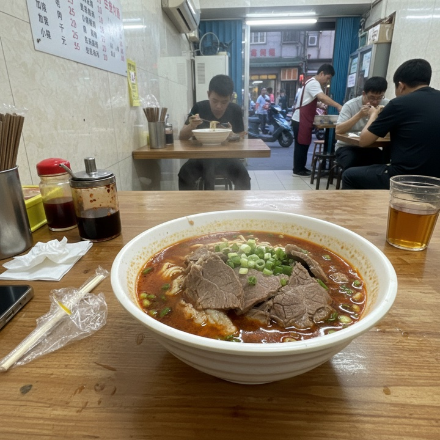

<div align="center">
  
  <h1>OpenMelon</h1>
  <p>A content-creation agent that runs in your terminal.</p>
</div>

```bash
openmelon -p "下班吃一碗牛肉面，发条真实的探店帖" \
  --skill skillplus:food-street-realism \
  --llm openrouter --llm-model openai/gpt-5.5 \
  --image-provider openrouter --image-model google/gemini-2.5-flash-image
```

→ generates a structured prompt with [`skillplus`](https://github.com/eight-acres-lab/skillplus), routes it through the LLM you configured, generates an image, and writes everything to `.openmelon/artifacts/` with a provenance JSONL line. Optionally publishes to V-Box via `vbox-cli`.

## OpenMelon vs. direct image prompting

The same intent can go straight to an image model, or through OpenMelon's `skillplus → LLM → image` pipeline. OpenMelon turns a short creative intent into a richer generation prompt before image generation.

<table>
  <tr>
    <th>Intent</th>
    <th>Direct prompt</th>
    <th>With OpenMelon</th>
  </tr>
  <tr>
    <td><code>下班吃一碗牛肉面，发条真实的探店帖</code></td>
    <td></td>
    <td></td>
  </tr>
  <tr>
    <td><code>A cozy wooden cabin with warm lights, surrounded by a snowy pine forest at dusk.</code></td>
    <td></td>
    <td></td>
  </tr>
</table>

## Install

```bash
npm install -g @e8s/openmelon @e8s/skillplus
```

`@e8s/openmelon` is a Node shim that fetches the matching Go binary from GitHub Releases on install (verified against `SHASUMS256.txt`). To build from source instead:

```bash
go install github.com/eight-acres-lab/openmelon/cmd/openmelon@latest
```

For `--publish vbox`, also:

```bash
npm install -g @e8s/vbox-cli
```

## Authentication

Set whichever you have. `--llm auto` (default) picks based on what's set, preferring Anthropic.

| Variable | Purpose |
|---|---|
| `ANTHROPIC_API_KEY` | LLM via Anthropic |
| `OPENAI_API_KEY` | LLM and/or image generation via OpenAI |
| `OPENROUTER_API_KEY` | LLM and/or image generation via OpenRouter |
| `OPENAI_BASE_URL` | route OpenAI calls through a relay (LiteLLM, Helicone, etc.) |
| `VBOX_API_KEY` | required for `--publish vbox` |

## Commands

```
openmelon -p "<intent>" --skill skillplus:<name> [flags]
openmelon --project <path>                         # legacy declarative workflow
openmelon                                           # help
```

### Common flags

| Flag | Default | Notes |
|---|---|---|
| `-p` | — | one-shot intent. Triggers agent mode. |
| `--skill` | `skillplus:food-street-realism` | `skillplus:<name>` / `path:<dir>` / `<bare path>` |
| `--llm` | `auto` | `auto` / `anthropic` / `openai` / `openrouter` |
| `--llm-model` | — | required. e.g. `openai/gpt-5.5`, `claude-sonnet-4-6`, `x-ai/grok-4` |
| `--image` | `true` | set `--image=false` to skip image generation |
| `--image-provider` | `openai` | `openai` / `openrouter` |
| `--image-model` | — | required when `--image=true`. e.g. `gpt-image-1`, `google/gemini-2.5-flash-image` |
| `--image-size` | vendor default | e.g. `1024x1024`, `1792x1024` |
| `--locale` | `zh-CN` | passed to the skill compiler |
| `--model-profile` | `gpt-image-family` | per-skill prompt overlay |
| `--publish` | — | `vbox` to upload + post via `vbox-cli` |
| `--artifact-dir` | `.openmelon/artifacts` | where images + provenance go |
| `--json` | `false` | also print run summary as JSON to stdout |

`openmelon --help` for the full list.

## How it works

```
intent + skill name
   ↓
skillplus compile  →  compiled prompt + output schema
   ↓
LLM (streamed)     →  structured JSON {generation_prompt, ...}
   ↓
image generator    →  PNG
   ↓
artifact + provenance JSONL
```

Skills are reusable "filters" — a skill package describes what to ask the LLM, not what to ask the image model. The LLM turns the skill contract plus your intent into a concrete generation prompt; the image model paints from that prompt. Every run records a JSONL line capturing skill version, model ids, intent, image SHA-256, and timing — re-runs are reproducible from the line alone.

## Sub-agent integration

`openmelon` is invokable from any agent CLI that can run a shell command. Drop-in Skill files for Claude Code and Cursor are in [`examples/integrations/`](examples/integrations/).

## End-to-end testing

See [`docs/testing.md`](docs/testing.md) for the full recipe (direct CLI, `--publish vbox`, Claude Code Skill paths).

## License

[Apache 2.0](LICENSE).
